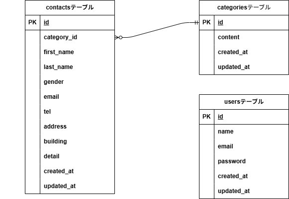

#お問い合わせフォーム

##環境構築
Dockerビルド
    1.git clone git@github.com:yminamo5-code/test1_otoiawaseform.git
    2.docker compose up -d --build

Laravelのパッケージのインストール環境構築
    1.docker-compose exec php bash
    2.composer install
    3..env.exampleファイルから.envを作成し、環境変数を変更
        DB_DATABASE=laravel_db
        DB_USERNAME=laravel_user
        DB_PASSWORD=laravel_pass
    4.php artisan key:generate
    5.php artisan migrate
    6.php artisan db:seed

##使用技術（実行環境）
    Laravel Framework 8.83.8
    php 8.1-fpm
    nginx 1.21.1
    mysql 8.0.26
    phpmyadmin
    Laravel Fortify
    ###フロントエンド###
        html
        css
        

##ER図
    
    作成ツール: draw.io (diagrams.net)

##URL
    お問い合わせフォーム：http://localhost/
    ユーザー登録：http://localhost/register
    phpMyAdmin:http://localhost:8080/